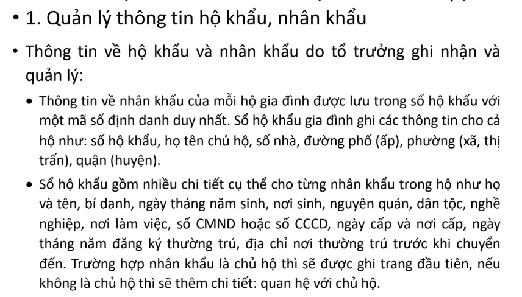
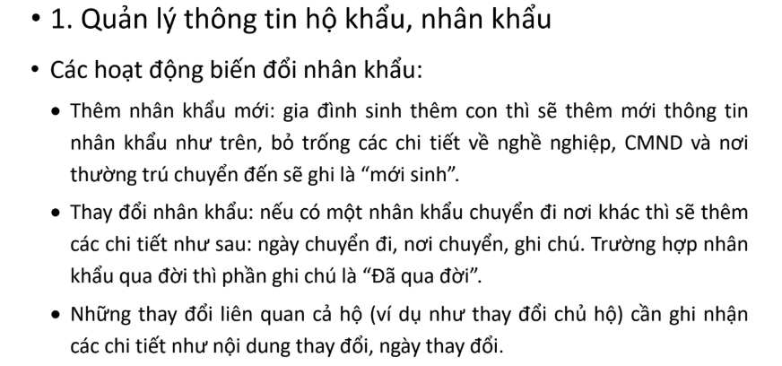
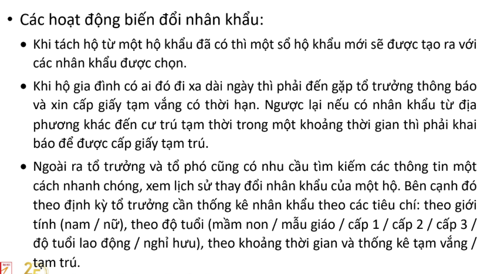
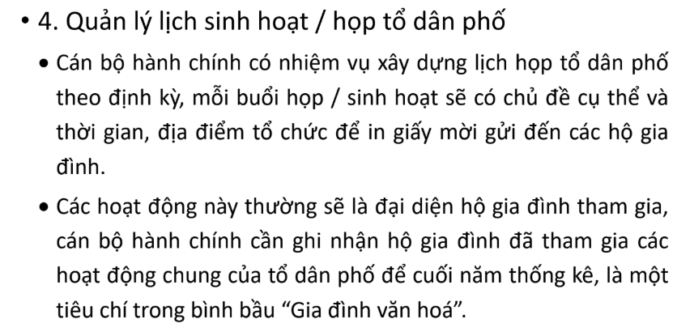

# Project_CNPM

## Backend Team

**Set up environment**

### Bước 1 — Tạo virtualenv và kích hoạt
    - Windows (PowerShell)
        python -m venv venv
        venv\Scripts\Activate

    - Linux / macOS
        python3 -m venv venv
        source venv/bin/activate

### Bước 2 — Cài đặt tất cả thư viện cần thiết
    pip install -r requirements.txt

### Làm việc với database 
    create an .env file in root directory then update fields same with DATABASES part in the setting file of quan_li_dan_cu directory

## Chức năng hệ thống Quản lý Khu Dân Cư

### 1️. Quản lý Nhân khẩu
- Mục tiêu: Quản lý thông tin cá nhân của từng người dân.
- Chức năng:
    - Thêm mới nhân khẩu. Tuấn
    - Cập nhật thông tin nhân khẩu. Tuấn
    - Xem chi tiết nhân khẩu. Sơn
    - Xóa nhân khẩu (hoặc đánh dấu là đã chuyển đi / qua đời). Khoa
    - Tìm kiếm nhân khẩu theo tên, CCCD, ngày sinh, hộ gia đình. Sơn
    - Ghi lại lịch sử thay đổi nhân khẩu (LichSuThayDoiNhanKhau). Khoa

### 2️. Quản lý Hộ gia đình
- Mục tiêu: Quản lý thông tin hộ dân trong khu dân cư.
- Chức năng:
    - Thêm mới hộ gia đình (bao gồm chủ hộ).
    - Cập nhật địa chỉ, thông tin chủ hộ.
    - Xem danh sách thành viên trong hộ.
    - Thêm hoặc chuyển nhân khẩu giữa các hộ.
    - Xóa hộ (hoặc đánh dấu giải thể hộ).
    - Tra cứu hộ theo địa chỉ hoặc tên chủ hộ.

### 3️. Quản lý Tạm trú - Tạm vắng
- Mục tiêu: Theo dõi biến động nhân khẩu trong khu dân cư.
- Chức năng:
    - Tạo phiếu tạm trú / tạm vắng cho nhân khẩu.
    - Xem chi tiết phiếu.
    - Gia hạn / kết thúc thời gian tạm trú.
    - Lọc theo loại phiếu, thời gian, trạng thái còn hiệu lực.
    - Xuất danh sách người đang tạm trú / tạm vắng.

### 4. Quản lý Sự kiện & Thông báo
- Mục tiêu: Quản lý các buổi họp dân cư, ghi nhận tham gia.
- Chức năng:
    - Tạo buổi sinh hoạt (chủ đề, ngày giờ, địa điểm, nội dung).
    - Cập nhật thông tin buổi sinh hoạt.
    - Xem danh sách hộ gia đình tham gia / vắng mặt.
    - Ghi nhận tham gia (app ThamGiaSinhHoat).
    - Thống kê tỷ lệ tham gia theo buổi / theo hộ.

### 5. Quản lý Tài khoản người dùng
- Mục tiêu: Xác thực và phân quyền người dùng.
- Chức năng:
    - Đăng nhập, đăng xuất.
    - Phân quyền (Cán bộ quản lý / Người dân).
    - Đổi mật khẩu, quản lý thông tin tài khoản.
    - Nếu có frontend riêng: đăng ký tài khoản người dân (optional).

### 6. Thống kê & Báo cáo
- Mục tiêu: Phân tích và thống kê dữ liệu phục vụ quản lý.
- Chức năng:
    - Thống kê dân số toàn khu / theo giới tính / độ tuổi.
    - Thống kê số hộ gia đình, trung bình nhân khẩu / hộ.
    - Thống kê tạm trú – tạm vắng trong một khoảng thời gian.
    - Thống kê lịch sử thay đổi nhân khẩu.
    - Thống kê gia đình đạt danh hiệu "Gia đình văn hóa" cuối năm.
    - Tạo biểu đồ, xuất báo cáo (PDF / Excel). (optional)

### 7. API Backend (Django REST Framework)
- Xây dựng các API endpoint cho từng app (CRUD + filter).
- Thêm xác thực JWT Token (bằng djangorestframework-simplejwt).
- Thêm phân quyền API (chỉ cán bộ mới được sửa/xóa).
- Viết serializer cho các model.
- Viết unit test API (nếu có thời gian).
- Viết README hướng dẫn cài backend.

## Frontend Team
### Frontend (React hoặc Vue)
- Trang đăng nhập / đăng xuất.
- Dashboard tổng quan (thống kê nhanh).
- Quản lý danh sách nhân khẩu.
- Quản lý hộ gia đình (chi tiết, thành viên).
- Quản lý tạm trú/tạm vắng (hiển thị + tìm kiếm).
- Quản lý lịch sinh hoạt (hiển thị danh sách + cập nhật tham gia).
- Trang thống kê (biểu đồ, bộ lọc thời gian).
