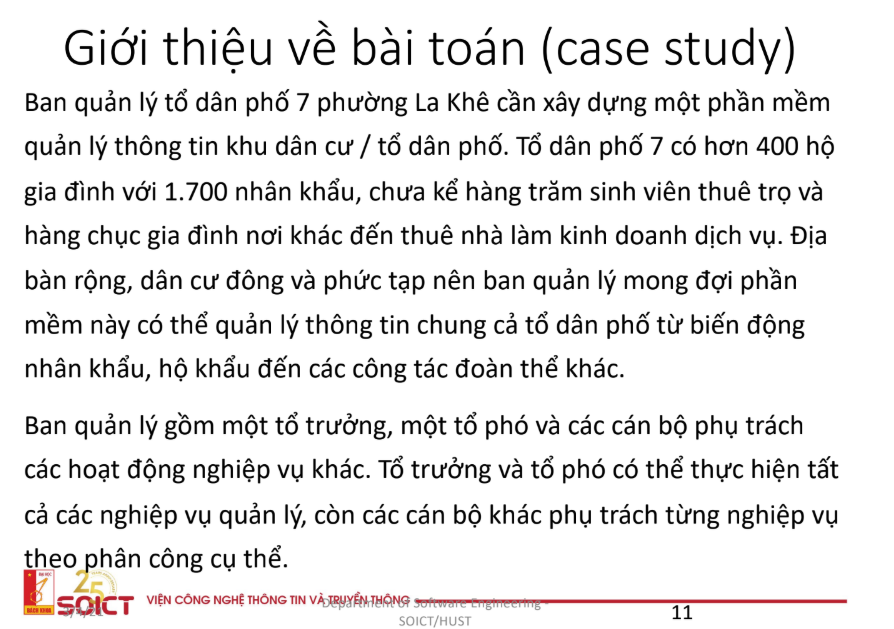
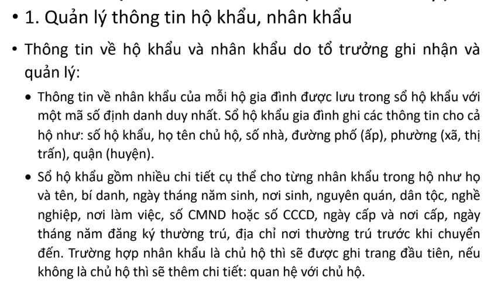
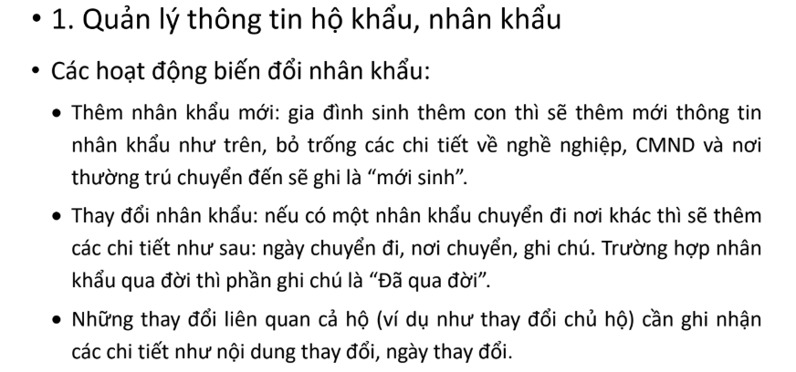
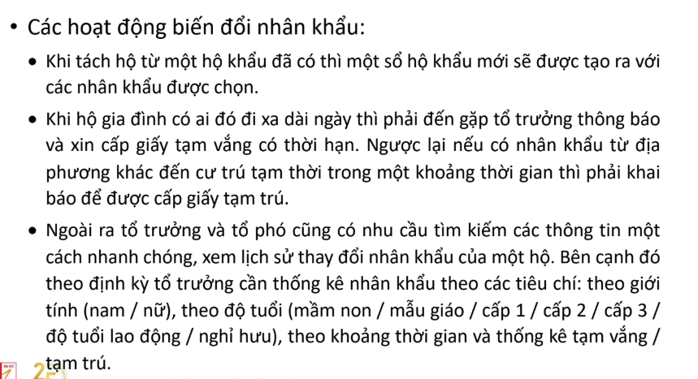
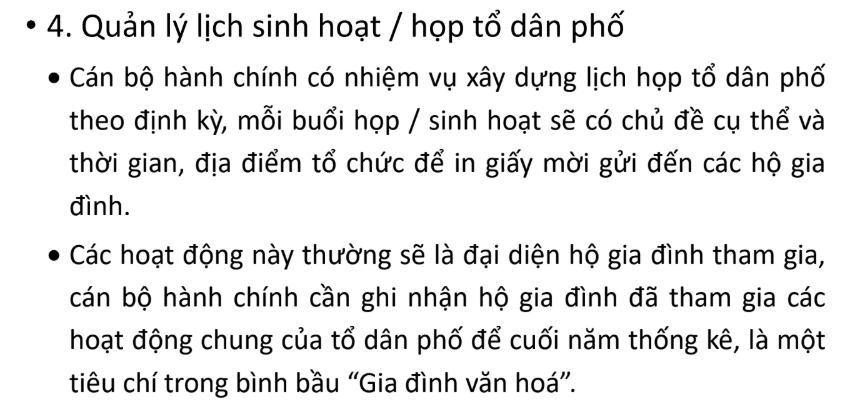

# Project_CNPM

## Backend Team

**Set up environment**

### Bước 1 — Tạo virtualenv và kích hoạt
    - Windows (PowerShell)
        python -m venv venv
        venv\Scripts\Activate

    - Linux / macOS
        python3 -m venv venv
        source venv/bin/activate

### Bước 2 — Cài đặt tất cả thư viện cần thiết
    pip install -r requirements.txt

### Bước 3 - Làm việc với database 
    tạo file .env ở thư mục chính rồi copy file env_example vào

### Bước 4: chạy chương trình
    1. chạy backend: 
        python manage.py runserver
    2. chạy frontend :
        cd frontend
        npm start
### Lưu ý: vì tài khoản mới tạo tự động sẽ là người dân nên không thể đăng nhập vào các trang cán bộ / admin, các bước cần làm:
- Cách 1:
      - đầu tiên tạo superuser : python manage.py createsuperuser
      - sau đó vào trang admin và thực hiện phân quyền tài khoản cho tài khoản (người dân/cán bộ/admin)
- Cách 2(dễ hơn):
      - vào trang admin của django và phân quyền trực tiếp cho tài khoản.
    

## Chức năng hệ thống Quản lý Khu Dân Cư

### 1️. Quản lý Nhân khẩu (Đã hoàn thành)
- Mục tiêu: Quản lý thông tin cá nhân của từng người dân.
- Chức năng:
    - Thêm mới nhân khẩu. Tuấn
    - Cập nhật thông tin nhân khẩu. Tuấn
    - Xem chi tiết nhân khẩu. Sơn
    - Xóa nhân khẩu (hoặc đánh dấu là đã chuyển đi / qua đời). Khoa
    - Tìm kiếm nhân khẩu theo tên, CCCD, ngày sinh, hộ gia đình. Sơn
    - Ghi lại lịch sử thay đổi nhân khẩu (LichSuThayDoiNhanKhau). Khoa

### 2️. Quản lý Hộ gia đình
- Mục tiêu: Quản lý thông tin hộ dân trong khu dân cư.
- Chức năng:
    - Thêm mới hộ gia đình (bao gồm chủ hộ). (Done)
    - Cập nhật địa chỉ, thông tin chủ hộ. (Done)
    - Xem danh sách thành viên trong hộ. (Done)
    - Thêm thành viên. (Done)
    - tách hộ.
    - xem thông tin biến động nhân khẩu của 1 hộ. (Done)
    - Xóa hộ. (Done)
    - Tra cứu hộ theo địa chỉ hoặc tên chủ hộ.(Done)

### 3️. Quản lý Tạm trú - Tạm vắng (ứng với trang phê duyệt yêu cầu của cán bộ) - Đỗ Sơn
- Mục tiêu: Theo dõi biến động nhân khẩu trong khu dân cư.
- Chức năng:
    - Tạo phiếu tạm trú / tạm vTuấn
- Mục tiêu: Quản lý các buổi họp dân cư, ghi nhận tham gia.
- Chức năng:
    - Tạo buổi sinh hoạt (chủ đề, ngày giờ, địa điểm, nội dung).
    - Cập nhật thông tin buổi sinh hoạt.
    - Xem danh sách hộ gia đình tham gia / vắng mặt.
    - Ghi nhận tham gia / vắng mặt (cần trao đổi lại để rõ ràng hơn nên làm thế nào).
    - Thống kê tỷ lệ tham gia theo buổi / theo hộ (dùng để đánh giá gia đình văn hóa cuối năm).

### 5. Quản lý Tài khoản người dùng (Đã hoàn thành)
- Mục tiêu: Xác thực và phân quyền người dùng.
- Chức năng:
    - Đăng nhập, đăng xuất.
    - Phân quyền (Cán bộ quản lý / Người dân).
    - Đổi mật khẩu, quản lý thông tin tài khoản.

### 6. Thống kê & Báo cáo (Làm ở trang thống kê của cán bộ) - Đăng Khoa
- Mục tiêu: Phân tích và thống kê dữ liệu phục vụ quản lý.
- Chức năng:
    - Thống kê dân số toàn khu / theo giới tính / độ tuổi.
    - Thống kê tạm trú – tạm vắng trong một khoảng thời gian.
    - Thống kê gia đình đạt danh hiệu "Gia đình văn hóa" cuối năm.
    - Tạo biểu đồ thống kê - trực quan hóa (optional).

## Frontend Team
to run :
1. cd frontend
2. npm start
### Frontend (React hoặc Vue)
- Trang đăng nhập / đăng xuất.
- Dashboard tổng quan (thống kê nhanh).
- Quản lý danh sách nhân khẩu.
- Quản lý hộ gia đình (chi tiết, thành viên).
- Quản lý tạm trú/tạm vắng (hiển thị + tìm kiếm).
- Quản lý lịch sinh hoạt (hiển thị danh sách + cập nhật tham gia).
- Trang thống kê (biểu đồ, bộ lọc thời gian).
